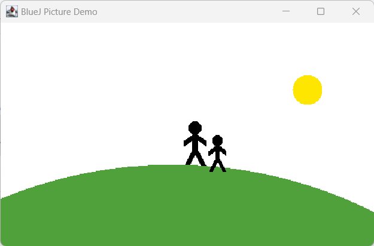

# Module 1: Java Foundations
## Day 5: Introduction to Java through BlueJ
### Work from Home

1. Similar to class work, take note of all properties of objects of other classes: `Square`, `Triangle`, and `Person`. And observe which methods of these objects are affecting which properties of these classes.
2. Choose one of these images and recreate it using the shapes from the _figures_ project. While you are doing this, write down what you have to do to achieve this. Could it be done in different ways?
   
   
