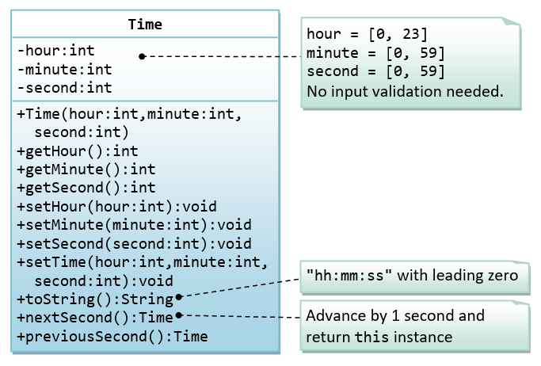

# Module 1: Java Foundations
{: .no_toc }
## Day 14: Object Interactions
{: .no_toc }

<details open markdown="block">
  <summary>
    Table of contents
  </summary>
  {: .text-delta }
1. [Session 1](#session-1)
   {:toc}
2. [Session 2](#session-2)
   {:toc}
3. [Practice Session](#practice-session)
   {:toc}
</details>

## Session 1
### Experimenting with Expressions in Code Pad

1. Try the following:  
   `sum = 99 + 3;`  
   Observe the error.  
   Now try the following:

   ```java
   int sum = 0;
   sum = 99 + 3;
   sum
   ```

   Now, try this:  
   `String swimmer = "cat" + "fish";`  
   `swimmer`  
   What would you expect to see after the following?  
   `String fish = swimmer;`  
   `fish`  
   Try it out. What do you think has happened in the assignment?

3. Open the Code Pad in the _better-ticket-machine_ project. Type the following in the Code Pad:

   ```java
   TicketMachine t1 = new TicketMachine(1000);
   t1.getBalance()
   t1.insertMoney(500);
   t1.getBalance()
   ```

   Take care to type these lines exactly as they appear here; pay particular attention to whether or not there is a semicolon at the end of the line. Note what the calls to `getBalance` return in each case.
4. Now add the following in the Code Pad:  
   `TicketMachine t2 = t1;`  
   What would you expect a call to `t2.getBalance()` to return? Try it out.
5. Add the following:  
    `t1.insertMoney(500);`
   What would you expect the following to return? Think carefully about this before you try it, and be sure to use the `t2` variable this time.  
   `t2.getBalance()`  
   Did you get the answer you expected? Can you find a connection between the variables `t1` and `t2` that would explain what is happening?

## Session 2
### The Clock display project intro

Demo first..  

**Download the projects:**  
[Number Display](../../../projects/bluej/part03/)
[Clock Display](../../../projects/bluej/part03/clock-display.zip)

Explore the classes. Create objects, inspect objects and observe what happens to fields when methods are invoked. Observe how methods are changing values of fields, which fields are affected. And also observe what type of value is showing Time here and how is it getting effected.

Before moving with this project, we will try to build a smaller version of this project. We will build just one class named `Time` as given in the below class diagram:


Implement all the methods except `toString()` method.

## Practice Session
### Let's Experiment
1. Create a `Time` object and test if all the methods are working as expected.
2. Inspect `ClockDisplay` object, and observe how time is shown in the following format:  
   `hh:mm`  
3. Write a method named, `getTime` that takes no parmeter and returns a String in the following format:
   `hh:mm:ss`
4. Set the time to `12:59:58`
5. Invoke `nextSecond()` method twice and observe the values in *Inspect* window. Do you observe anything strange?
6. Open source code of `ClockDisplay` class for *clock-display* project. Observe the code of `timeTick` method. The code may look strange but on close observation, we see that `minutes` is incremented once, and then `hours` is incremented only if `minutes` value is `0`.  
   To further understand how `increment` is working, let's explore another class, `NumberDisplay`. Open `NumberDisplay` class and check the `increment` method in it.  
   `value = (value + 1) % limit;`  
   **Discuss:** How is it working?
7. Implement similar behavior in `nextSecond` and `previousSecond` methods of `Time` class.
8. Is it working as expected? Is it updating the `minute` and `hour` values accordingly when `second` rolls over to `0` after `59`?
9. Update the changes accordingly.
10. Let's go deeper into the working of `getTime` method. Observe the time value of `ClockDisplay` object when `hour` or `minute` values are single digits. You will see that there is an extra `0` before the value. Try implementing this behavior in `getTime` method of `Time` class.
11. Observe the source code of `getDisplayValue` method of `NumberDisplay` class. Try applying similar code to `getTime` method of `Time` class.
12. A better way of implementing this behavior in `getTime` method of `Time` class.
    Using String variables to be updated using leading 0 when it is single digit, instead of updating the whole time format
