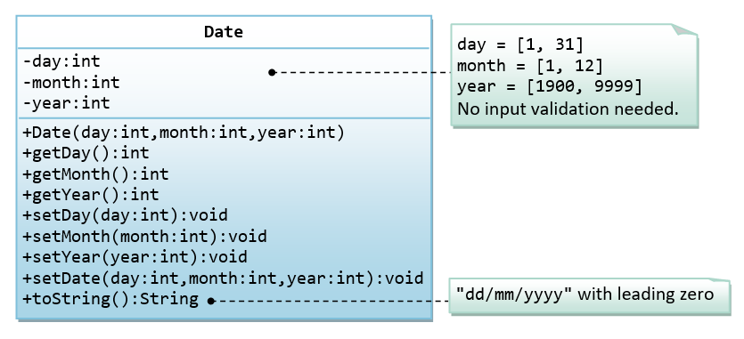

# Module 1: Java Foundations
## Week 2: Foundations of OOP & Algorithmic Thinking
### Day 14: Object Interactions (Foundations with Time)

## Work from Home

1. Finish the following methods in `Time` class just like `nextSecond` method:
   - `nextMinute`
   - `nextHour`
   - `previousSecond`
   - `previousMinute`
   - `previousHour`
2. Write another class named `Date` as given in the below image:
   