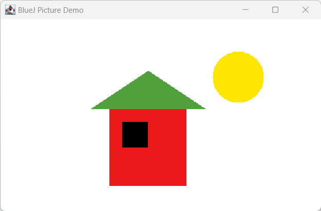
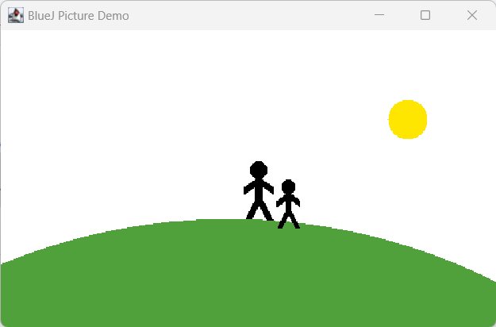

# Experiment

<details open markdown="block">
  <summary>
    Table of contents
  </summary>
  {: .text-delta }
1. [Experiments on _figures_ project](#experiments-on-figures-project)
   {:toc}
2. [Figures Challenge](#figures-challenge)
   {:toc}
3. [Experiments on _house_ project](#experiments-on-house-project)
   {:toc}
4. [Experiments on _lab-classes_ project](#experiments-on-lab-classes-project)
   {:toc}
</details>

## Experiments on _figures_ project
1. Start BlueJ and open the project named _figures_.
   Right-click on one of the circle objects (not the class!), Choose `makeVisible` from the menu. Observe what happens…  
   Try:  
   - `moveRight`
   - `moveDown`
   - `makeInvisible`
   - `makeVisible`
2. _Experiment:_ What happens if you call `moveDown` twice? Or three times? What happens if you call `makeInvisible` twice?
3. Invoke the `moveHorizontal` method. You will see a dialog appear that prompts you for some input. Type in 50 and click OK. Observe what happens…  
**Discuss:** How is it different from `moveRight` or `moveLeft` ?
4. Try invoking the `moveVertical`, `slowMoveVertical`, and `changeSize` methods before you move on.
5. **Challenge:** Find out how you can use `moveHorizontal` to move the circle 70 pixels to the left.
   Experiment if `moveVertical` moves the circle up in the same way.
6. Try invoking the `changeColor` method and see what happens when you specify a color that is not known.
7. Invoke the `changeColor` method, and write the color into the parameter field without the quotes. What happens?
8. Create several circle objects on the object bench. You can do so by selecting `new Circle()` from the pop-up menu of the `Circle` class. Make them visible, then move them around on the screen using the "move" methods. Make one big and yellow; make another one small and green. Try the other shapes too: create a few triangles, squares, and persons. Change their positions, sizes, and colors.  
**Discuss:** Does changing an attribute of one object affect another object?
9. **Experiment:** Make sure you have several objects on the object bench, and then inspect each of them in turn. Try changing the state of an object (for example, by calling the moveLeft method) while the object inspector is open. You should see the values in the object inspector change.
   
10. Select *Show Terminal* from the *View* menu. This shows another window that BlueJ uses for text output. Then select *Record method calls* from the terminal’s *Options* menu. This function will cause all our method calls (in their textual form) to be written to the terminal. Now create a few objects, call some of their methods, and observe the output in the terminal window.
11. Let's now save this code somewhere safe and we will revisit it later.
12. Select *Show Code Pad* from the *View* menu. This should display a new pane next to the object bench in your main BlueJ window. This pane is the *Code Pad*. You can type Java code here.
13. Try copying the recorded lines one-by-one and paste in Code Pad and observe how those instructions are doing the same thing what we did using *mouse-clicks*.

### Figures Challenge

Choose any one of the following images or make your own:  
1. 
2. 

## Experiments on _house_ project

0. Go to [Learn](../quiz_gen/learn#download-week-1-bluej-projects), download the _house_ project ==> extract it to your projects folder.
1. Open the _house_ project using BlueJ. Create an instance of class `Picture` and invoke its `draw` method. Also, try out the `setBlackAndWhite` and `setColor` methods. How do you think the `Picture` class draws the picture?

### Observing Picture class

1. Look at the pop-up menu of class `Picture` again. You will see an option labeled _Open Editor_. Select it. This will open a text editor displaying the source code of the class.
2. In the source code of class `Picture`, find the part that actually sets the picture to black and white and change it to red and yellow.  
   **Practice:** Change them to any colors of your choice. Once satisfied and understood how it's working, then turn it back to black and white.
3. In the source code of class `Picture`, find the part that actually draws the picture. Change it so that the sun will be blue rather than yellow.
4. Add a second sun to the picture. To do this, pay attention to the field definitions close to the top of the class. You will find this code:

   ```java
   private Square wall;
   private Square window;
   private Triangle roof;
   private Circle sun;
   ```

   You need to add a line here for the second sun. For example:  
   `private Circle sun2;`  
   Then write the appropriate code in two different places for creating the second sun and making it visible when the picture is drawn.

[Back to Top](#top)

### Experiments on _lab-classes_ project

0. Go to [Learn](../quiz_gen/learn#download-week-1-bluej-projects), download the _lab-classes_ project ==> extract it to your projects folder.
1. Create an object of class `Student`. You will notice that this time you are prompted not only for a name of the instance, but also for some other parameters. Fill them in before clicking OK. (Remember that parameters of type `String` must be written within double quotes.)
2. Create some `Student` objects. Call the `getName` method on each object. Explain what is happening.
3. Create an object of class `LabClass`. As the signature indicates, you need to specify the maximum number of students in that class (an integer).
4. Call the `numberOfStudents` method of that class. What does it do?
5. Look at the signature of the `enrollStudent` method. You will notice that the type of the expected parameter is `Student`. Make sure you have two or three students and a `LabClass` object on the object bench, then call the `enrollStudent` method of the `LabClass` object. With the input cursor in the dialog entry field, click on one of the student objects; this enters the name of the student object into the parameter field of the `enrollStudent` method. Click OK and you have added the student to the `LabClass`. Add one or more other students as well.
6. Call the `printList` method of the `LabClass` object. You will see a list of all the students in that class printed to the BlueJ terminal window
7. Create three students with the following details:

   ```
   Suneetha, student ID: A00234, credits: 24
   Lata Mangeshkar, student ID: C22044, credits: 56
   Papon, student ID: A12003, credits: 6
   ```

   Then enter all three into a lab and print a list to the screen.

8. Use the inspector on a `LabClass` object to discover what fields it has.
9. Set the instructor, room, and time for a lab, and print the list to the terminal window to check that these new details appear.

[Back to Top](#top)
