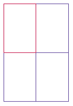

# Check Your Understanding
## Making Decisions (Conditionals)

<!-- <details open markdown="block">
  <summary>
    Table of contents
  </summary>
  {: .text-delta }
1. [Easy Level Code Writing Questions](#easy-level-code-writing-questions)
   {:toc}
2. [Medium Level Code Writing Questions](#medium-level-code-writing-questions)
   {:toc}
3. [Hard Level Code Writing Questions](#hard-level-code-writing-questions)
   {:toc}
</details> -->

1. What is the value of each variable after the if statement?  
    a. 

    ```java
    int n = 1;  
    int k = 2;  
    int r = n;  
    if (k < n) { r = k; }  
    ```
    b.
    
    ```java
    int n = 1;  
    int k = 2;  
    int r;  
    if (n < k) { r = k; }  
    else { r = k + n; } 
    ```
    c.
    
    ```java
    int n = 1;  
    int k = 2;  
    int r = k;  
    if (r < k) { n = r; }  
    else { k = n; } 
    ```
    d.
    
    ```java
    int n = 1;  
    int k = 2;  
    int r = 3;  
    if (r < n + k) { r = 2 * n; }  
    else { k = 2 * r; } 
    ```
      

2. Explain the difference between  

    ```java
    s = 0;  
    if (x > 0) { s++; }  
    if (y > 0) { s++; }  
    ```
    
    and

    ```java  
    s = 0;  
    if (x > 0) { s++; }  
    else if (y > 0) { s++; }
    ```

3. Find the errors in the following if statements.  
   a. `if x > 0 then System.out.print(x);`  
   b. `if (1 + x > Math.pow(x, Math.sqrt(2)) { y = y + x; }` 
   c. `if (x = 1) { y++; }`  
   d.
    
      ```java
      x = in.nextInt();
      if (in.hasNextInt())
      {
            sum = sum + x;
      }
      else
      {
            System.out.println("Bad input for x"); 
      }
      ```
    e.
    
      ```java
      String letterGrade = "F";  
      if (grade >= 90) { letterGrade = "A"; }  
      if (grade >= 80) { letterGrade = "B"; }  
      if (grade >= 70) { letterGrade = "C"; }  
      if (grade >= 60) { letterGrade = "D"; }
      ```
4. What do these code fragments print?  
    a.
    
      ```java
      int n = 1;  
      int m = -1;  
      if (n < -m) { System.out.print(n); }  
      else { System.out.print(m); }
      ```
    b.
    
      ```java
      int n = 1;  
      int m = -1;  
      if (-n >= m) { System.out.print(n); }  
      else { System.out.print(m); }
      ```
    c.
    
      ```java
      double x = 0;  
      double y = 1;  
      if (Math.abs(x - y) < 1) { System.out.print(x); }  
      else { System.out.print(y); }
      ```
    d.
    
      ```java
      double x = Math.sqrt(2);  
      double y = 2;  
      if (x * x == y) { System.out.print(x); }  
      else { System.out.print(y); }
      ```

5. Suppose x and y are variables of type double. Write a code fragment that sets y to x if x
is positive and to 0 otherwise.

6. Suppose x and y are variables of type double. Write a code fragment that sets y to the
absolute value of x without calling the `Math.abs` function. Use an if statement.

7. Explain why it is more difficult to compare floating-point numbers than integers. Write Java code to test whether an integer n equals 10 and whether a floating-point number x is approximately equal to 10.

8. Given two pixels on a computer screen with integer coordinates (x1 , y1) and (x2 , y2),
write conditions to test whether they are  
   a. The same pixel.  
   b. Very close together (with distance < 5).
   
9. It is easy to confuse the `=` and `==` operators. Write a test program with the statement  
   `if (floor = 13)`  
   What error message do you get? Write another test program with the statement  
   `count == 0;`  
   What does your compiler do when you compile the program?

10. Write pseudocode for a program that prompts the user for a month and day and prints out whether it is one of the following four holidays:  
    • New Year’s Day (January 1)  
    • Independence Day (August 15)  
    • Christmas Day (December 25)  


[Back to Top](#top)

<!-- ### Medium Level Code Writing Questions
1. Write a program that initializes a string with "Mississippi". Then replace all "i" with "ii" and print the length of the resulting string. In that string, replace all "ss" with "s" and print the length of the resulting string.

2. 

[Back to Top](#top) -->

<!-- ### Hard Level Code Writing Questions
1. Write a program called `FourRectanglePrinter` that constructs a `Rectangle` object, prints its location by calling `System.out.println(box)`, and then translates and prints it three more times, so that, if the rectangles were drawn, they would form one large rectangle, as shown below. Your program will not produce a drawing. It will simply print the locations of the four rectangles.  


2. 

[Back to Top](#top) -->
