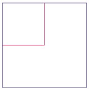
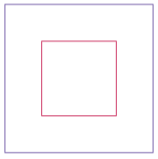

# Practice Questions (Code Writing)
## Soft Intro to Java with BlueJ (Objects & Classes)

<details open markdown="block">
  <summary>
    Table of contents
  </summary>
  {: .text-delta }
1. [Easy Level Code Writing Questions](#easy-level-code-writing-questions)
   {:toc}
2. [Medium Level Code Writing Questions](#medium-level-code-writing-questions)
   {:toc}
3. [Hard Level Code Writing Questions](#hard-level-code-writing-questions)
   {:toc}
</details>

### Easy Level Code Writing Questions

1. Calculate the number of days a person lived given their birth and death dates:
   > ```java
   // Assume the person was born on January 1, 2000, and died on December 31, 2020.
   ```

   <details markdown="block">
     <summary>Answer</summary>
     The person lived for 7661 days.
   </details>

2. Write a line of code to declare a variable `temperature` and assign it a value of `36.6`.
   
   <details markdown="block">
     <summary>Answer</summary>
     double temperature = 36.6;
   </details>

3. Write a line of code to declare a `String` variable `greeting` and assign it the value `"Hello, World!"`.
   
   <details markdown="block">
     <summary>Answer</summary>
     String greeting = "Hello, World!";
   </details>

4. Given the following line of code:
   > ```java
   int score = 10;
   ```
   Write the line of code to assign the value `50` to `score`.
   
   <details markdown="block">
     <summary>Answer</summary>
     score = 50;
   </details>

12. Complete the code snippet to print the following result:
    > ```java
    +----------+
    |   Code   |
    +----------+
    public class NameInBox
    {
       public static void main(String[] args)
       {
          // TODO print Code in a box made from
          // characters - | +
       }
    }
    ```
    <details markdown="block">
      <summary>Answer</summary>
      ```java
      public class NameInBox
      {
         public static void main(String[] args)
         {
            System.out.println("+----------+");
            System.out.println("|   Code   |");
            System.out.println("+----------+");
         }
      }
      ```
    </details>

13. Write the code to construct a `Circle` with its center at `(150, 75)` and a radius of `25`. Assign it to a variable named `circle`. Use this construction parameters: (int x, int y, int radius)
    
    <details markdown="block">
      <summary>Answer</summary>
      Circle circle = new Circle(150, 75, 25);
    </details>

14. Write the code to construct a triangle with vertices at `(0, 0)`, `(10, 0)`, and `(5, 8.66)`. Assign it to a variable named `triangle`. Use this construction parameters: (int x1, int y1, int x2, int y2, int x3, int y3)
    
    <details markdown="block">
      <summary>Answer</summary>
      Triangle triangle = new Triangle(0, 0, 10, 0, 5, 8.66);
    </details>

1. Write a program that prints your name in large letters, such as  

   > ```
   *       *  *  *    *      *       * * * *
    *     *   *  *  *       * *     *
     *   *    *  *         *   *     * * * *
      * *     *  *  *     * * * *           *
       *      *  *    *  *       *   * * * * 
   ```

2. Write a program that prints your name in Morse code, like this:  
   > `...- .. -.- .- ...`  

   Use a separate call to `System.out.print` for each letter.

3. Write a program that prints a face similar to (but different from) the following:  
   > ```
     ///// 
    +"""""+ 
   (| o o |)
    |  ^  |
    | '-' |
    +-----+
   ```

4. Write a program that prints a house that looks exactly like the following:  

   > ```
      +
     + +
   +     + 
   +-----+ 
   | .-. | 
   | | | |
   +-+-+-+
   ```

5. Write a program that prints an animal speaking a greeting, similar to (but different from) the following:  
   > ```
    /\_/\       -----
   ( ' ' )    / Hello \ 
   (  -  )   < Junior  | 
    | | |     \ Coder!/ 
   (__|__)      -----
   ```

6. Write a program that prints three items, such as the names of your three best friends or favorite movies, on three separate lines.

7. Write a program that prints India flag, using special symbols you find on your keyboard.

8. Type in and run the following program. Then modify it to show the message “Hello, your name!”.
   > ```
   import javax.swing.JOptionPane;
   public class DialogViewer {
      public static void main(String[] args) {
         JOptionPane.showMessageDialog(null, "Hello, World!");
      } 
   }
   ```

9. Write a program that prints a two-column list of your friends’ birthdays. In the first column, print the names of your best friends; in the second, print their birthdays.


[Back to Top](#top)

### Medium Level Code Writing Questions
1. Write a program that initializes a string with "Mississippi". Then replace all "i" with "ii" and print the length of the resulting string. In that string, replace all "ss" with "s" and print the length of the resulting string.

2. Look into the API documentation of the `String` class and locate the `trim` method. Write a program demonstrating what it does. Then show how you can use the `replace` method to remove all spaces from a string.

3. (TEST) Write an `AreaTester` program that constructs a `Rectangle` object and then computes and prints its `area`. Use the `getWidth` and `getHeight` methods. Also print the expected answer.

4. (TEST) Write a `PerimeterTester` program that constructs a `Rectangle` object and then computes and prints its `perimeter`. Use the `getWidth` and `getHeight` methods. Also print the expected answer.

5. (TRICKY) Write a program that constructs a rectangle with area 42 and a rectangle with perim-
eter 42. Print the widths and heights of both rectangles.

6. (TEST) Look into the API documentation of the `Rectangle` class and locate the method void `add(int newx, int newy)`  
   Read through the method documentation. Then determine the result of the following statements:  
   `Rectangle box = new Rectangle(5, 10, 20, 30);`   
   `box.add(0, 0);`  

   Write a program `AddTester` that prints the expected and actual location, width, and height of box after the call to add.

7. (TEST) Write a program `ReplaceTester` that encodes a string by replacing all letters `"i"` with `"!"` and all letters `"s"` with `"$"`. Use the `replace` method. Demonstrate that you can correctly encode the string "Mississippi". Print both the actual and expected result.

8. Write a program `HollePrinter` that switches the letters `"e"` and `"o"` in a string. Use the replace method repeatedly. Demonstrate that the string `"Hello, World!"` turns into `"Holle, Werld!"`

9. (TEST) The `StringBuilder` class has a method for reversing a string. In a `ReverseTester` class, construct a `StringBuilder` from a given string (such as "desserts"), call the `reverse` method followed by the `toString` method, and print the result. Also print the expected value.

10. In the Java library, a color is specified by its red, green, and blue components between 0 and 255. Write a program `BrighterDemo` that constructs a `Color` object with red, green, and blue values of 50, 100, and 150. Then apply the `brighter` method of the Color class and print the red, green, and blue values of the resulting color. (You won’t actually see the color.)

11. Repeat above exercise, but apply the `darker` method of the `Color` class twice to the object `Color.RED`. Call your class `DarkerDemo`.

12. The `Random` class implements a random number generator, which produces sequences of numbers that appear to be random. To generate random integers, you construct an object of the `Random` class, and then apply the `nextInt` method. For example, the call `generator.nextInt(6)` gives you a random number between 0 and 5. Write a program `DieSimulator` that uses the `Random` class to simulate the cast of a die, printing a random number between 1 and 6 every time that the program is run.

13. Write a program `RandomPrice` that prints a random price between $10.00 and $19.95 every time the program is run.

14. (TEST) Look at the API of the `Point` class and find out how to construct a `Point` object. In a `PointTester` program, construct two points with coordinates (3, 4) and (–3, –4). Find the distance between them, using the `distance` method. Print the distance, as well as the expected value. (Draw a sketch on graph paper to find the value you will expect.)

15. Using the `Day` class, write a `DayTester` program that constructs a Day object representing today, adds ten days to it, and then computes the difference between that day and today. Print the difference and the expected value.

16. Using the `Picture` class, write a `HalfSizePicture` program that loads a picture and shows it at half the original size, centered in the window.

17. Using the `Picture` class, write a `DoubleSizePicture` program that loads a picture, doubles its size, and shows the center of the picture in the window.

[Back to Top](#top)

### Hard Level Code Writing Questions
1. Write a program called `FourRectanglePrinter` that constructs a `Rectangle` object, prints its location by calling `System.out.println(box)`, and then translates and prints it three more times, so that, if the rectangles were drawn, they would form one large rectangle, as shown below. Your program will not produce a drawing. It will simply print the locations of the four rectangles.  


2. Write a `GrowSquarePrinter` program that constructs a `Rectangle` object square representing a square with top-left corner (100, 100) and side length 50, prints its location by calling `System.out.println(square)`, applies the translate and grow methods, and calls `System.out.println(square)` again. The calls to `translate` and `grow` should modify the square so that it has twice the size and the same top-left corner as the original. If the squares were drawn, they would look like the figure below. Your program will not produce a drawing. It will simply print the locations of square before and after calling the mutator methods. Look up the description of the `grow` method in the API documentation.  


3.  Write a `CenteredSquaresPrinter` program that constructs a `Rectangle` object square representing a square with top-left corner (100, 100) and side length 200, prints its location by calling `System.out.println(square)`, applies the grow and translate methods, and calls `System.out.println(square)` again. The calls to `grow` and `translate` should modify the square so that it has half the width and is centered in the original square. If the squares were drawn, they would look like the figure below. Your program will not produce a drawing. It will simply print the locations of square before and after calling the mutator methods. Look up the description of the grow method in the API documentation.  


4. The `BigInteger` class represents integer numbers with an arbitrary number of digits. (As you will see later, the `int` type cannot express very large integers.) You can construct a `BigInteger` object by providing a string of its digits, such as  
   > `BigInteger a = new BigInteger("12345678987654321");`  

   Write a program that prints the square, fourth power, and eighth power of a, using one of the methods of the BigInteger class.

5. Write a program `LotteryPrinter` that picks a combination in a lottery. In this lottery, players can choose 6 numbers (possibly repeated) between 1 and 49. Construct an object of the `Random` class and invoke an appropriate method to generate each number. (In a real lot tery, repetitions aren’t allowed, but we haven’t yet discussed the programming con structs that would be required to deal with that problem.) program should print out a sentence such as “Play this combination—it’ll make you rich!”, followed by a lottery combination.

6. Using the `Day` class, write a program that generates a `Day` object representing February 28 of this year, and three more such objects that represent February 28 of the next three years. Advance each object by one day, and print each object. Also print the expected values:  
   > ```
   2019-02-29  
   Expected: 2019-02-29  
   2020-03-01  
   Expected: 2020-03-01  
   . . .
   ```

7. The `GregorianCalendar` class describes a point in time, as measured by the Gregorian calendar, the standard calendar that is commonly used throughout the world today. You construct a GregorianCalendar object from a year, month, and day of the month, like this:  
   > ```java
   GregorianCalendar cal = new GregorianCalendar(); // Today’s date 
   GregorianCalendar eckertsBirthday = new GregorianCalendar(1919, Calendar.APRIL, 9);
   ```

   Use the values `Calendar.JANUARY . . . Calendar.DECEMBER` to specify the month. The add method can be used to add a number of days to a `GregorianCalendar` object:  
   `cal.add(Calendar.DAY_OF_MONTH, 10); // Now cal is ten days from today`  
   This is a mutator method — it changes the cal object.  
   The `get` method can be used to query a given `GregorianCalendar` object:  
   > ```java
   int dayOfMonth = cal.get(Calendar.DAY_OF_MONTH);  
   int month = cal.get(Calendar.MONTH);  
   int year = cal.get(Calendar.YEAR);  
   int weekday = cal.get(Calendar.DAY_OF_WEEK); // 1 is Sunday, 2 is Monday, . . . , 7 is Saturday  
   ```

   Your task is to write a program that prints:  
   - The date and weekday that is 100 days from today. 
   - The weekday of your birthday. 
   - The date that is 10,000 days from your birthday.  
   
   Use the birthday of a computer scientist if you don’t want to reveal your own.  
   *Hint:* The `GregorianCalendar` class is complex, and it is a really good idea to write a few test programs to explore the API before tackling the whole problem.  
   Start with a program that constructs today’s date, adds ten days, and prints out the day of the month and the weekday.

8. The `LocalDate` class describes a calendar date that does not depend on a location or time zone. You construct a date like this:  
   > ```java
   LocalDate today = LocalDate.now(); // Today’s date  
   LocalDate eckertsBirthday = LocalDate.of(1919, 4, 9);  
   ```

   The `plusDays` method can be used to add a number of days to a `LocalDate` object:  
   > `LocalDate later = today.plusDays(10); // Ten days from today`  

   This method does not mutate the `today` object, but it returns a new object that is a given number of days away from `today`. To get the year of a day, call  
   > `int year = today.getYear();`  

   To get the weekday of a LocalDate, call  
   > `String weekday = today.getDayOfWeek().toString();`  

   Your task is to write a program that prints 
   - The weekday of “Pi day”, that is, March 14, of the current year. 
   - The date and weekday of “Programmer’s day” in the current year; that is, the 256th day of the year. (The number 256, or 28, is useful for some programming tasks.)
   - The date and weekday of the date that is 10,000 days earlier than today.

9. (TEST) Write a program `LineDistanceTester` that constructs a line joining the points (100, 100) and (200, 200), then constructs points (100, 200), (150, 150), and (250, 50). Print the distance from the line to each of the three points, using the `ptSegDist` method of the `Line2D` class. Also print the expected values. (Draw a sketch on graph paper to find what values you expect.)

[Back to Top](#top)
