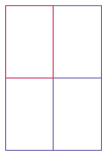

# Check Your Understanding
## Loops

<!-- 

  

    Table of contents
  

  {: .text-delta }
1. [Easy Level Code Writing Questions](#easy-level-code-writing-questions)
   {:toc}
2. [Medium Level Code Writing Questions](#medium-level-code-writing-questions)
   {:toc}
3. [Hard Level Code Writing Questions](#hard-level-code-writing-questions)
   {:toc}

 -->

1. 

[Back to Top](#top)

<!-- ### Medium Level Code Writing Questions
1. Write a program that initializes a string with "Mississippi". Then replace all "i" with "ii" and print the length of the resulting string. In that string, replace all "ss" with "s" and print the length of the resulting string.

2. 

[Back to Top](#top) -->

<!-- ### Hard Level Code Writing Questions
1. Write a program called `FourRectanglePrinter` that constructs a `Rectangle` object, prints its location by calling `System.out.println(box)`, and then translates and prints it three more times, so that, if the rectangles were drawn, they would form one large rectangle, as shown below. Your program will not produce a drawing. It will simply print the locations of the four rectangles.  

2. 

[Back to Top](#top) -->
